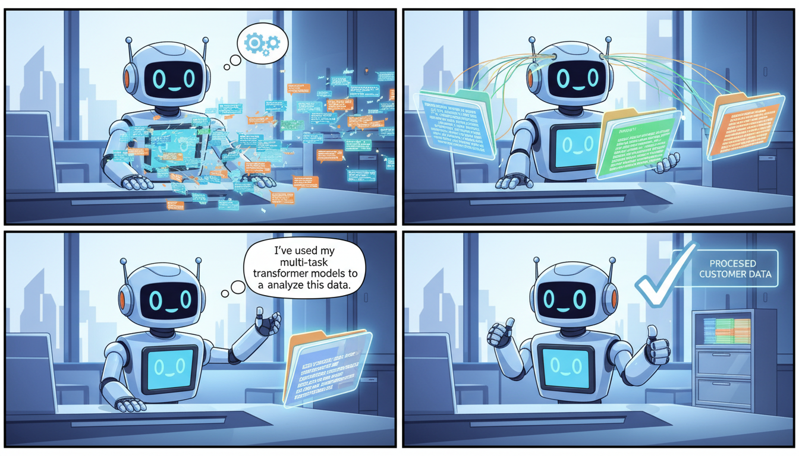

This is a comprehensive, professional `README.md` tailored for the **predictdesk-backend** repository. It reflects the multi-task nature of the project while providing clear instructions for setup, usage, and deployment.

---

# PredictDesk Backend

[](https://www.python.org/)
[](https://flask.palletsprojects.com/)
[](https://pytorch.org/)
[](https://huggingface.co/docs/transformers/index)

PredictDesk Backend is a high-performance Python-based service designed for **multi-task and multi-class text prediction**. It leverages Deep Learning models (Transformer architecture) to categorize text input into various classes such as sentiment, intent, or priority.

Built with **Flask** and **PyTorch**, this backend is container-ready and prepared for deployment on cloud platforms like Heroku, AWS, or IBM Cloud.

---

## 🚀 Features

-   **Multi-Task Prediction**: Ability to predict multiple attributes from a single text input using a unified model architecture.
-   **RESTful API**: Clean endpoints for health monitoring, model metadata, and inference.
-   **Pre-trained Transformer Support**: Built-in support for Hugging Face tokenizers and custom PyTorch weights.
-   **Production Ready**: Includes `Dockerfile`, `Procfile`, and `manifest.yml` for various deployment environments.
-   **Robust Pre-processing**: Integrated label encoders and tokenization pipelines.

---

## 🛠️ Tech Stack

-   **Language**: Python 3.9+
-   **Web Framework**: Flask, Flask-RESTful
-   **Machine Learning**: PyTorch, Hugging Face Transformers
-   **Data Processing**: Pandas, Scikit-learn (LabelEncoders)
-   **Deployment**: Docker, Gunicorn

---

## 📁 Project Structure

```text
predictdesk-backend/
├── app.py                     # API entry point and routes
├── multitask_model.py         # Model architecture definition (PyTorch)
├── resources/
│   └── multitask_model/       # Model artifacts
│       ├── model_weights.pt   # Trained PyTorch weights
│       ├── label_encoders.pkl # Categorical mappings
│       ├── vocab.txt          # Tokenizer vocabulary
│       └── tokenizer.json     # Tokenizer configuration
├── Dockerfile                 # Containerization instructions
├── Procfile                   # Process file for Heroku/PaaS
├── requirements.txt           # Python dependencies
└── .env                       # Environment variables
```

---

## 📥 Installation

### 1. Clone the repository
```bash
git clone https://github.com/your-repo/predictdesk-backend.git
cd predictdesk-backend
```

### 2. Create a Virtual Environment
```bash
python -m venv venv
source venv/bin/activate  # On Windows: venv\Scripts\activate
```

### 3. Install Dependencies
```bash
pip install -r requirements.txt
```

### 4. Set up Environment Variables
Create a `.env` file in the root directory:
```env
FLASK_ENV=production
PORT=5000
MODEL_PATH=resources/multitask_model
```

---

## 🏃 Running the Application

### Development Mode
```bash
python app.py
```
The API will be available at `http://localhost:5000`.

### Using Docker
```bash
docker build -t predictdesk-backend .
docker run -p 5000:5000 predictdesk-backend
```

---

## 📑 API Documentation

### 1. Health Check
**GET** `/health`  
Check if the service and model are active.

**Response:**
```json
{
  "status": "ok",
  "model_loaded": true
}
```

### 2. Model Information
**GET** `/model/info`  
Retrieve labels, encoder classes, and configuration.

### 3. Predict
**POST** `/predict`  
The main inference endpoint.

**Request Body:**
```json
{
  "text": "The service was excellent and the staff was very helpful."
}
```

**Response Example:**
```json
{
  "status": "success",
  "predictions": {
    "sentiment": "highly_satisfied",
    "intent": "feedback",
    "priority": "low"
  },
  "confidence_scores": {
    "sentiment": 0.98,
    "intent": 0.85,
    "priority": 0.92
  }
}
```

---

## 🐍 Python Usage Example

You can interact with the API programmatically using the `requests` library:

```python
import requests

def get_prediction(text):
    url = "http://localhost:5000/predict"
    payload = {"text": text}
    
    response = requests.post(url, json=payload)
    if response.status_code == 200:
        return response.json()
    else:
        return {"error": "Failed to get prediction"}

result = get_prediction("Me siento muy feliz con el resultado.")
print(f"Sentiment: {result['predictions']['sentiment']}")
```

---

## 🚢 Deployment

### Heroku
The included `Procfile` allows for seamless Heroku deployment:
```bash
heroku create predictdesk-backend
git push heroku main
```

### Cloud Foundry / IBM Cloud
The `manifest.yml` is provided for Cloud Foundry environments:
```bash
ibmcloud cf push
```

---

## 📄 License
This project is licensed under the MIT License - see the LICENSE file for details.

---
**PredictDesk Team** - *Powering intelligent desk automation.*